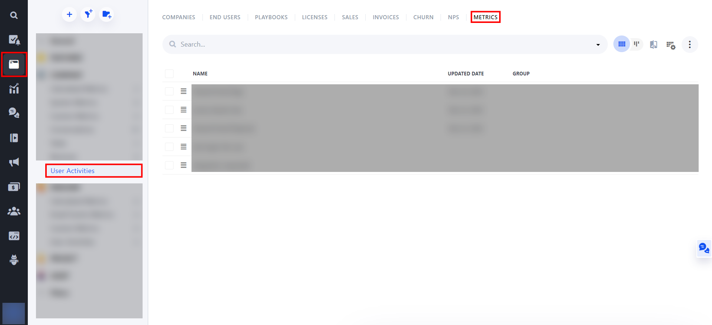

# Analytics plugin Planhat

This adds support for  [Planhat](https://www.planhat.com/) for the [Analytics](https://github.com/DavidWells/analytics) package.

# Installation

```
npm install analytics analytics-plugin-planhat --save
```

# Usage

## Browser (Vue, React, Angular)
```
import { Analytics } from "analytics"
import planhatPlugin from "analytics-plugin-planhat"

const analytics = Analytics({
  app: "[your app name]",
  plugins: [
    planhatPlugin({
      tenantUUID: "[your tenantUUID]",
    }),
  ],
})

```
[Example](./examples/browser/vue)

## Node
### CommonJS
```
const { Analytics } = require('analytics')
// or const Analytics = require('analytics').default
const planhatPlugin  = require('analytics-plugin-planhat')

const analytics = Analytics({
  app: "[your app name]",
  plugins: [
    planhatPlugin({
      tenantUUID: "[your tenantUUID]",
    }),
  ],
})
```
[Example](./examples/node/commonjs)

### ES6 Modules
```
import { Analytics } from 'analytics'
import planhatPlugin  from 'analytics-plugin-planhat'

const analytics = Analytics({
  app: "[your app name]",
  plugins: [
    planhatPlugin({
      tenantUUID: "[your tenantUUID]",
    }),
  ],
})
```
[Example](./examples/node/modules)
# Methods
## analytics.identify
Identify an user for which activities will be tracked.
```
analytics.identify([userId], {
  firstName: "[firstName]"",
  lastName: "[lastName]"",
  email: "[email]",
  companyExternalId:"[companyId]"
})
```
| Argument          | Description                                                                                    | 
| :----------       | :-----------------------------------------------------------------------                       | 
| **`userId`**      | Id for the Planhat user.<br> If you want to identify users by mail pass `null`                                                  |  
| **`email`**               | Email of the user. <br> Either userId or email is required to identify the user. <br> Provide an email if the userId is `null`.                                                        | 
| **`firstName`**         | Firstname of the Planhat user                                            | 
| **`lastName`**          | Lastname of the Planhat user                                             | 
| **`companyExternalId`** | ExternalId of a company in Planhat, the company must exist in Planhat. <br> Is required for the auto-creation of users.  |

## analytics.track
Track an user activity for the identified user.
```
analytics.track([activity name], {
  [extraAttribute]: [value],
  ...
})
```
| Argument          | Description                                                              | 
| :----------       | :----------------------------------------------------------------------- | 
| **`activity name`**     | Name of the tracked user activity                                      
| **`extraAttribute`**    | Add additional information about the user activity                       | 

If you only want to use this plugin:

```
analytics.track([activity name], 
  {
    [extraAttribute]:[value]
  },
  {
    plugins: {
      all: false,
      planhat: true
    }
  }
);
```
## More
More information about the usage of the methods and additional options can be found at the original analytics package:

- [Github](https://github.com/DavidWells/analytics)
- [Documentaion](https://getanalytics.io/)
# Planhat Webplatform
The tracked user activities can be found in the following locations:

- [Under metrics](https://app-eu.planhat.com/data/metrics)


- On a company page under the usage tab


- On a user page under the usage tab


# About PlanHat API

In order to track an activity of an user it must exist in Planhat. When an user is identified but doesn't exist in Planhat, it will be created automatically provided all the required info is passed in the request.

Planhat will still repsond with status code 200 if not all information is passed correctly. Errors can be found in the Planhat webplatform.

- [API errors](https://app-eu.planhat.com/developer)
- Errors with tracking an user activity can be found under metrics

More information can be found in their [API documentation](https://docs.planhat.com).


# Development
Go to the folder `plugin`.


Install dependenies
````
npm install
````
Build package

````
nmp run build
````

# Powered By


